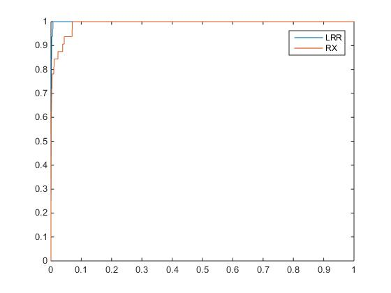
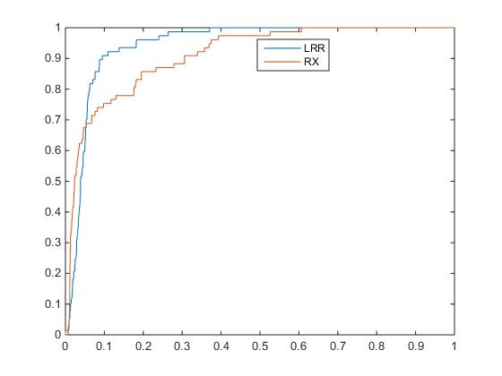

# Anomaly-Detection-in-Hyperspectral-Images-Based-on-Low-Rank-and-Sparse-Representation

## ROC curve

LHData dataset：

- AUC（LRR）=  0.9990；
- AUC（RX） =  0.9910；

LDData dataset：

- AUC（LRR）=  0.9443；
- AUC（RX） =  0.9106；

## [Details](README.docx)

## Reference:

Regularization for spectral matched filter and RX anomaly detector

Robust Subspace Segmentation by Low-Rank Representation

Anomaly Detection in Hyperspectral Images Based on Low-Rank and Sparse Representation

